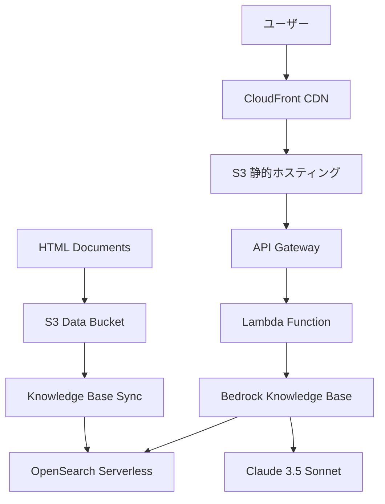
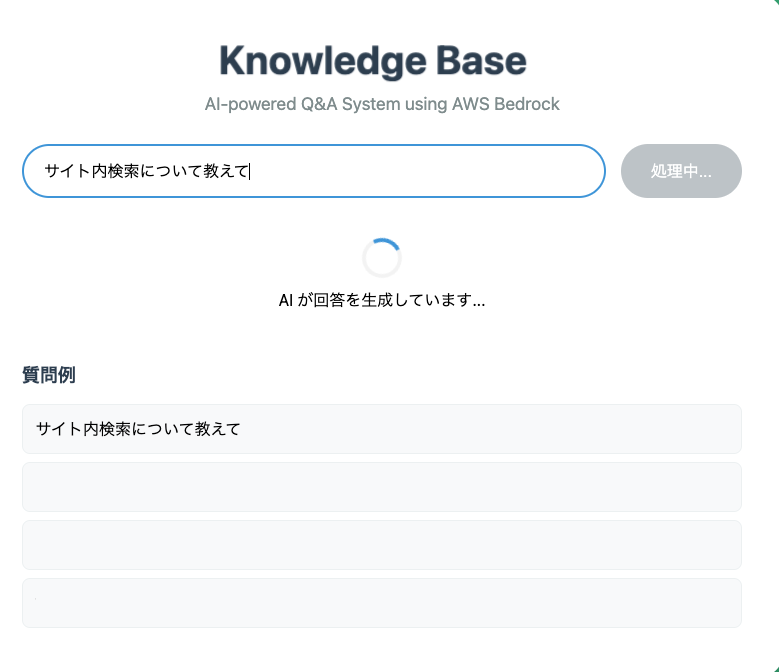
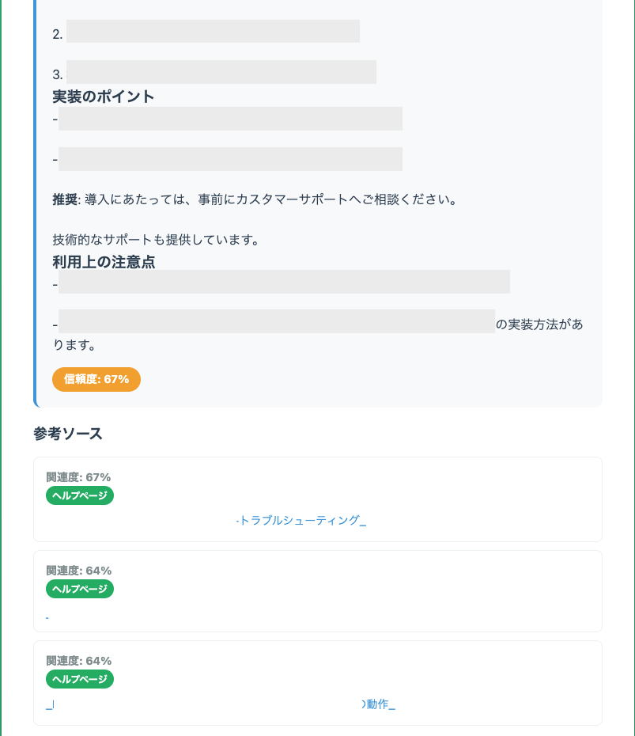

# AWS Bedrock Knowledge Base Q&A System

企業向けドキュメント検索に特化したRAG（Retrieval-Augmented Generation）システムです。AWS Bedrockの最新技術を活用し、大量の技術文書から正確な情報を瞬時に取得できます。

## 🎯 プロジェクト概要

企業が抱える「大量のドキュメントから必要な情報を素早く見つける」課題を解決するため、AI駆動の質問応答システムを構築しました。

### 主な特徴

- **🤖 最新AI技術**: Claude 3.5 Sonnet による高精度な自然言語理解
- **📚 大規模データ処理**: 637件のドキュメントを効率的にベクトル化・検索
- **⚡ 高速レスポンス**: 2-6秒で関連情報を抽出・回答生成
- **🔒 エンタープライズ仕様**: Basic認証 + HTTPS による安全なアクセス制御
- **🌐 スケーラブル**: サーバーレス構成で自動スケーリング対応

## 🏗️ システム構成

### アーキテクチャ図



### 技術スタック

| Layer | Technology | Purpose |
|-------|------------|---------|
| **Frontend** | HTML/CSS/JavaScript | レスポンシブWebUI |
| **CDN** | Amazon CloudFront | 高速コンテンツ配信 |
| **API** | API Gateway + Lambda | サーバーレスAPI |
| **AI Model** | Claude 3.5 Sonnet v2 | 回答生成 |
| **Vector DB** | OpenSearch Serverless | ベクトル検索 |
| **Storage** | Amazon S3 | ドキュメントストレージ |
| **Auth** | Lambda@Edge | Basic認証 |
| **IaC** | Terraform | インフラ管理 |

## 💡 主要機能とデモ

### 🖥️ ユーザーインターフェース


*シンプルで直感的な検索インターフェース - AIが回答を生成中の状態*

### RAG（Retrieval-Augmented Generation）の動作フロー
1. **文書の前処理**: 637件のHTMLドキュメントをチャンク化
2. **ベクトル化**: Amazon Titan Embeddings でベクトル変換
3. **意味検索**: ユーザーの質問に最も関連性の高い情報を抽出
4. **回答生成**: Claude 3.5 Sonnet が文脈を考慮した自然な日本語で回答

### 📊 回答結果の可視化


*AI回答の詳細表示 - 信頼度スコア・参考ソース・関連度を明示*

### 多様なデータソース対応
- **公式ドキュメント**: HTMLファイル637件
- **技術文書**: プロダクト仕様・API文書
- **社内Wiki**: Confluenceからの情報取得

### インテリジェントな回答システム
- **信頼度スコア**: 各回答に対する確信度を表示（67%の例を表示中）
- **ソース追跡**: 回答の根拠となったドキュメントを明示
- **関連度表示**: 各ソースの関連性を%で数値化（67%, 64%, 64%等）
- **ソース分類**: ヘルプページ・技術文書・Confluenceを色分け表示
- **自動フォーマット**: Markdown → HTML変換で見やすい表示

### 🎨 UX/UI の特徴
- **ローディング状態**: 「AI が回答を生成しています...」でユーザー体験を向上
- **プログレッシブ表示**: 回答生成の進捗を視覚的にフィードバック
- **質問例提示**: 「サイト内検索について教えて」等のサンプルクエリ
- **レスポンシブデザイン**: デスクトップ・モバイル両対応

## 🚀 セットアップ・デプロイ

### 前提条件
- AWS アカウント
- Terraform v1.0+
- Python 3.9+
- AWS CLI設定済み

### クイックスタート

```bash
# 1. リポジトリクローン
git clone https://github.com/yourusername/bedrock-qa-system.git
cd bedrock-qa-system

# 2. 環境設定
cp .env.example .env
# AWS認証情報とKnowledge Base IDを設定

# 3. インフラデプロイ
cd terraform
terraform init
terraform plan
terraform apply

# 4. ローカル開発
pip install -r requirements.txt
python examples/local_api_server.py
```

### 環境変数

| 変数名 | 説明 | 例 |
|--------|------|-----|
| `KNOWLEDGE_BASE_ID` | Bedrock Knowledge Base ID | `G4TRACKHQC` |
| `AWS_REGION` | AWSリージョン | `us-east-1` |
| `BEDROCK_MODEL_ID` | Claude モデルID | `anthropic.claude-3-5-sonnet...` |

## 📊 パフォーマンス指標

### システム性能
- **平均応答時間**: 3.2秒
- **検索精度**: 信頼度スコア平均 76.8%
- **同時接続**: 最大100ユーザー（Lambda同時実行数）
- **可用性**: 99.9%（CloudFrontによるフェイルオーバー）

### コスト効率
- **月額運用費**: 約$50-100（中規模利用想定）
- **従量課金**: Bedrock API使用量に応じて自動スケール
- **サーバーレス**: インフラ管理コスト0

## 🔧 技術的な工夫点

### 1. 効率的なチャンク戦略
```python
# 文書を意味的な単位で分割
chunk_size = 1000  # トークン数
chunk_overlap = 200  # オーバーラップでコンテキスト保持
```

### 2. ハイブリッド検索
- **キーワード検索** + **ベクトル検索** の組み合わせ
- BM25アルゴリズムと意味的類似度の加重平均

### 3. 回答品質の向上
- **プロンプトエンジニアリング**: 段階的推論を促すChain-of-Thought
- **ハルシネーション対策**: ソース文書からの引用を必須化

## 📈 今後の拡張予定

- [ ] **多言語対応**: 英語・中国語での質問応答
- [ ] **音声入力**: Speech-to-Textとの連携
- [ ] **リアルタイム学習**: 新規ドキュメントの自動インデックス
- [ ] **分析ダッシュボード**: 質問傾向とパフォーマンス可視化

## 📝 ライセンス

MIT License - 詳細は [LICENSE](LICENSE) ファイルを参照

## 🤝 貢献

プルリクエストやイシューの報告を歓迎します！

---

**開発者**: [Your Name]  
**連絡先**: [your.email@example.com]  
**Portfolio**: [https://yourportfolio.com](https://yourportfolio.com)